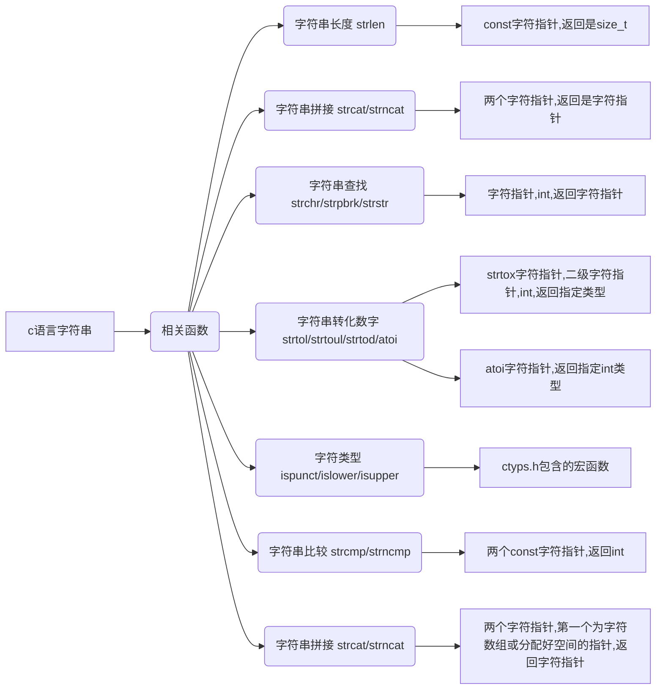

```mermaid
graph LR
c语言字符串 --> A(相关函数)
A --> B(字符串长度 strlen)
A --> C(字符串拼接 strcat/strncat)
A --> D(字符串查找 strchr/strpbrk/strstr)
A --> E(字符串转化数字 strtol/strtoul/strtod/atoi)
A --> F(字符类型 ispunct/islower/isupper)
A --> G(字符串比较 strcmp/strncmp)
A --> H(字符串拼接 strcat/strncat)

B-->const字符指针,返回是size_t;
C-->两个字符指针,返回是字符指针;
D-->字符指针,int,返回字符指针;
E-->strtox字符指针,二级字符指针,int,返回指定类型;
E-->atoi字符指针,返回指定int类型;
F-->ctyps.h包含的宏函数
G-->两个const字符指针,返回int
H-->两个字符指针,第一个为字符数组或分配好空间的指针,返回字符指针
```