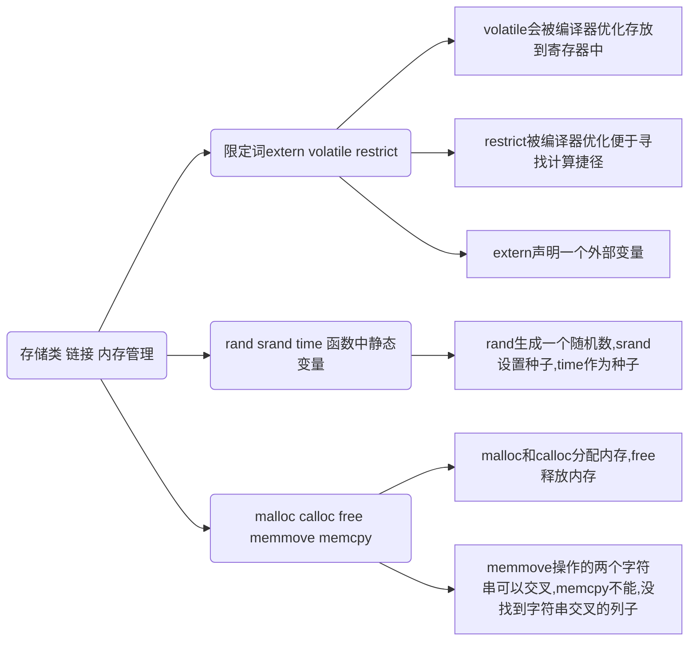

```mermaid
graph LR

A(存储类 链接 内存管理)-->B(限定词extern volatile restrict)
A-->C(rand srand time 函数中静态变量)
A-->D(malloc calloc free memmove memcpy)

C--> rand生成一个随机数,srand设置种子,time作为种子
D-->malloc和calloc分配内存,free释放内存
D-->memmove操作的两个字符串可以交叉,memcpy不能,没找到字符串交叉的列子

B-->volatile会被编译器优化存放到寄存器中
B-->restrict被编译器优化便于寻找计算捷径
B-->extern声明一个外部变量
```