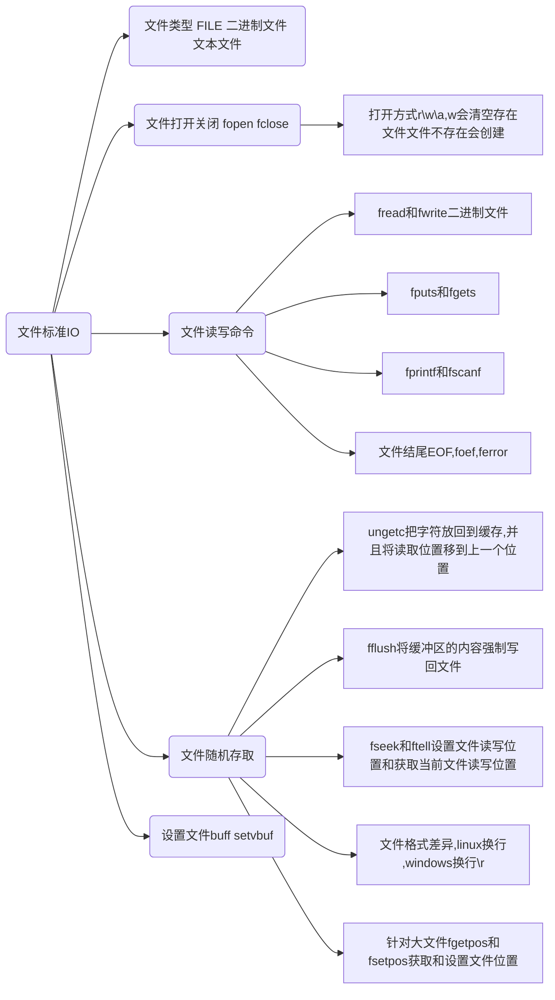

# 文件标准IO

```mermaid
graph LR
A(文件标准IO)-->B(文件类型 FILE 二进制文件 文本文件)
A-->C(文件打开关闭 fopen fclose)
A-->D(文件读写命令)
A-->E(文件随机存取)
A-->F(设置文件buff setvbuf)

C-->打开方式r\w\a,w会清空存在文件文件不存在会创建

D-->fread和fwrite二进制文件;
D-->fputs和fgets
D-->fprintf和fscanf
D-->文件结尾EOF,foef,ferror


E-->ungetc把字符放回到缓存,并且将读取位置移到上一个位置
E-->fflush将缓冲区的内容强制写回文件
E-->fseek和ftell设置文件读写位置和获取当前文件读写位置
E-->文件格式差异,linux换行\n,windows换行\r\n
E-->针对大文件fgetpos和fsetpos获取和设置文件位置

```