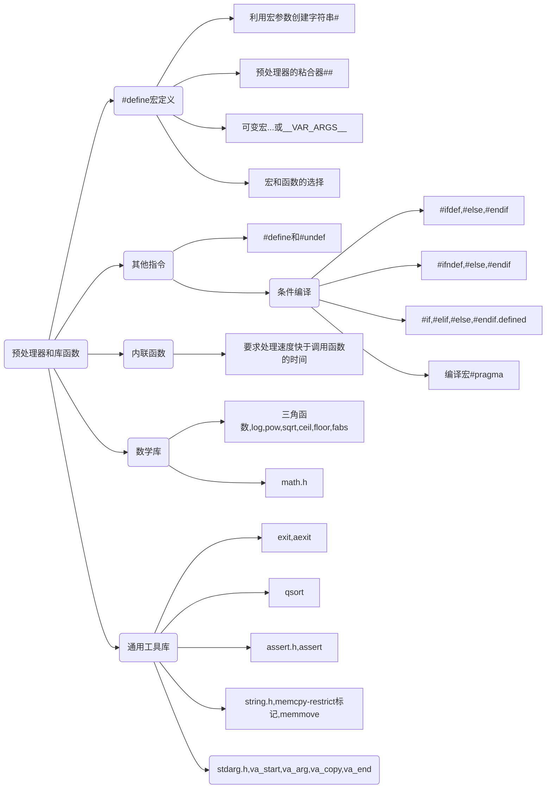

16章 预处理器 和 库



``` c
#define PRNT1(X) printf("the value of " #X "*" #X " is %d\n", X*X);
#define PRNT2(X,n) printf("the value of "#X#n"is %d\n", #X##n);
#define PRNT3(X,...) printf(#X ", funcation variable args is "__VAR_ARGS__);

void assert(scalar expression);

void *memcpy(void *dest, const void *src, size_t n);
void *memmove(void *dest, const void *src, size_t n);
```

